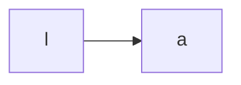

# kkk

> kd
 
link: [google](https://www.google.com)

[for any info](https://github.com/shd101wyy/markdown-preview-enhanced/tree/master/docs)

table
|a|b|
|:---:|:---:|
|hello|hi|

### Solar System Exploration, 1950s – 1960s

- [ ] Mercury
- [x] Venus
- [x] Earth (Orbit/Moon)
- [x] Mars
- [x] Jupiter
- [x] Saturn
- [ ] Uranus
- [ ] Neptune
- [ ] Comet Haley

:smile:

🔥
$f(x)= sin(x)$

chart

